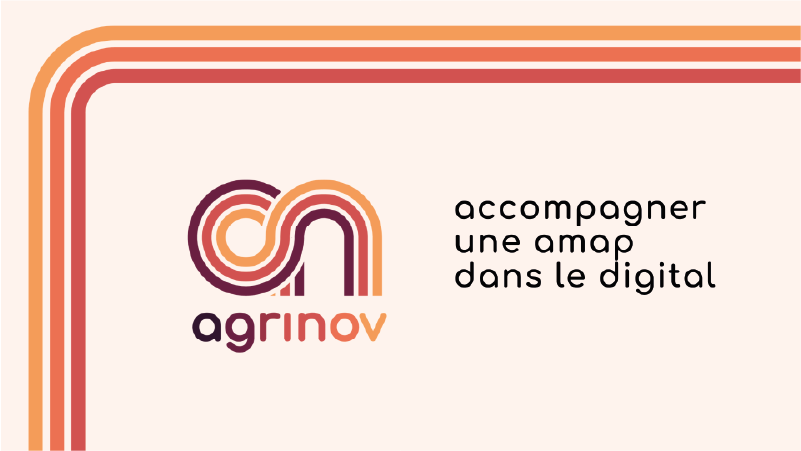
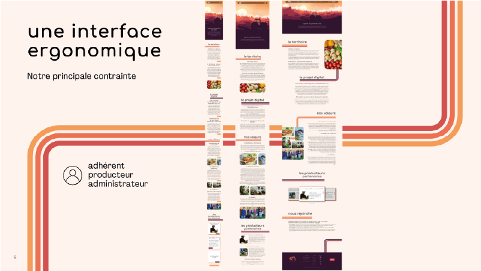
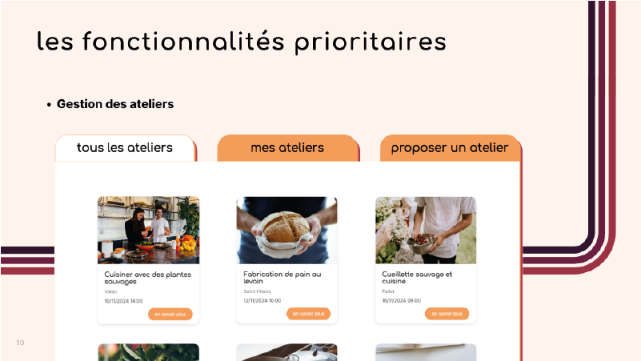
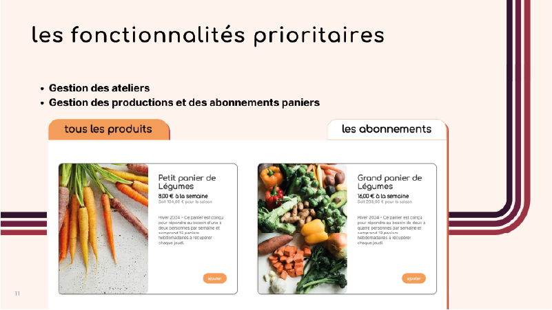
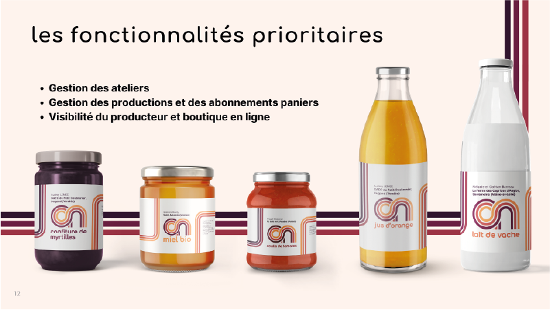
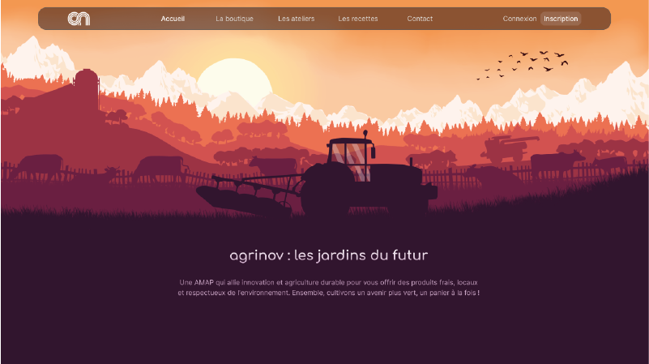

# AgriNov - Management App for an AMAP

## Introduction
AgriNov is a digital platform designed to support AMAPs (Associations for the Maintenance of Small-Scale Farming) initiatives. Based in Clisson, France, AgriNov embodies values of solidarity, equity, and transparency by fostering direct partnerships between local producers and consumers. Our project aims to enhance the AMAP experience through an intuitive digital platform, simplifying order management, community interactions, and workshop organization.

## Context & Challenges
Traditional AMAPs face challenges such as administrative burdens, lack of flexibility, and barriers to digital adoption. Our goal is to address these challenges by:
- Streamlining member and order management.
- Providing a seamless online platform for producers and consumers.
- Maintaining human connections through in-person workshops and events.

### Benefits of Digitalization
- **Simplified Management**: Automates member registration, order processing, and subscription management.
- **Increased Flexibility**: Enables users to customize their orders and adjust consumption.
- **Enhanced Communication**: Facilitates information sharing about seasonal products and farming practices.
- **Time-Saving**: Reduces administrative overhead, allowing organizers to focus on community engagement.

### Potential Risks
- **Loss of Human Interaction**: To mitigate this, AgriNov promotes regular in-person gatherings and workshops.
- **Digital Literacy Barriers**: The platform is designed with an intuitive interface to accommodate users with limited technical skills.

## Objectives & Features
The primary objective was to create an accessible and intuitive interface for all users—producers, members, and administrators—without requiring prior training. Key features include:

### Community Engagement
- **Workshop Management**: Members can propose, register for, and manage workshops, fostering knowledge exchange and strengthening community bonds.

### Producer Experience
- **Simplified Registration**: Producers can sign up, and AgriNov verifies their compliance with AMAP values.
- **Product Management**: Producers list their seasonal offerings, while AgriNov curates AMAP baskets by category and season.

- **Marketing Support**: AgriNov provides unified branding, manages stock, and handles online sales, ensuring fair revenue distribution.

## Development Approach
### Planning & Methodology
- **Requirement Analysis**: A two-week phase of specification writing with stakeholders.
- **Agile Development**: The project was structured into two-week sprints with iterative development and continuous feedback.
- **User-Centric Design**: Regular user testing ensured accessibility and ease of use.
- **Team Coordination**: Daily stand-up meetings facilitated progress tracking and issue resolution.

### Tech Stack
- **Backend**: C# with ASP.NET Core using the Model-View-Controller (MVC) pattern.
- **Database**: MySQL for storing members, orders, and products.
- **Frontend**: HTML, CSS, JavaScript for a dynamic user experience.

## Conclusion
AgriNov redefines AMAP management by integrating digital tools while preserving the essence of local farming communities. Through seamless technology adoption, we aim to enhance participation, simplify operations, and strengthen the connection between producers and consumers.

---

🚀 Built with passion to support local agriculture and sustainable food networks! 🌱
